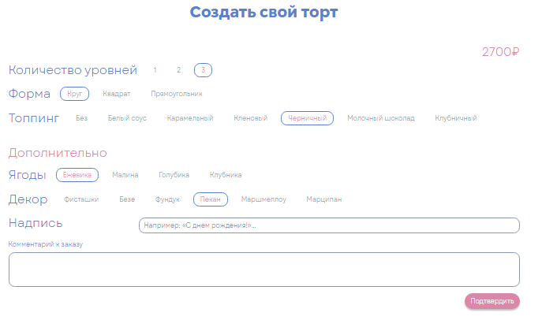
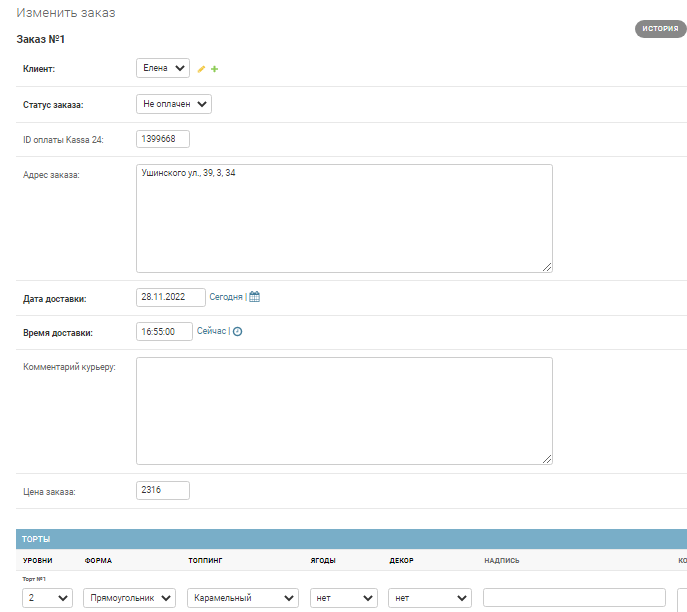

# Сайт магазина-пекарни тортов на заказ

Это [сайт](https://bake-cake.guspbru.ru/) магазина-пекарни тортов на заказ. Здесь можно заказать превосходные торты на ваш вкус с доставкой на дом.


## Описание

Cконструируйте торт на [сайте](https://bake-cake.guspbru.ru/) и укажите место доставки. Магазин-пекарня испечёт вкуснейший торт по вашему заказу и привезёт его вам.

На сайте есть два независимых интерфейса. Первый — это [публичная часть](https://bake-cake.guspbru.ru/), где можно выбрать или сконструировать торт, и быстро оформить заказ без регистрации и sms.



Второй интерфейс — это [административная панель](https://bake-cake.guspbru.ru/admin/) сайта, она предназначена для менеджера. Здесь происходит обработка заказов. Менеджер видит поступившие новые заказы и первым делом созванивается с клиентом, чтобы подтвердить заказ. После этого менеджер передаёт заказ на исполнение. Затем торт испекут и доставят его клиенту.



Кроме этого, в админке есть возможность выгрузить выбранные заказы в файл csv и файлы других форматов, а также посмотреть, с каких рекламных страниц и в каком количестве проходили клиенты на сайт.

## Как установить

Скачайте код:
```
git clone https://github.com/Irina-Kasatkina/bake_cake
```

Перейдите в каталог проекта:
```
cd bake_cake
```

[Установите Python](https://www.python.org/), если вы этого ещё не сделали.

Проверьте, что `python` установлен и корректно настроен. Запустите его в командной строке:
```
python --version
```
**Важно!** Версия Python должна быть не ниже 3.6.

Возможно, вместо команды `python` здесь и в остальных инструкциях этого README придётся использовать `python3`. Зависит это от операционной системы и от того, установлен ли у вас Python старой второй версии. 

В каталоге проекта создайте виртуальное окружение:
```
python -m venv venv
```
Активируйте его. На разных операционных системах это делается разными командами:

- Windows: `.\venv\Scripts\activate`
- MacOS/Linux: `source venv/bin/activate`


Установите зависимости в виртуальное окружение:
```
pip install -r requirements.txt
```
### Переменные окружения

Создайте файл `.env` в каталоге `bake_cake/` и запишите туда следующие переменные окружения в формате `ПЕРЕМЕННАЯ=значение`:
- `ALLOWED_HOSTS`- разрешённые хосты, см. [документацию Django](https://docs.djangoproject.com/en/3.1/ref/settings/#allowed-hosts).
- `DATABASE_ENGINE` - движок базы данных, например: `django.db.backends.sqlite3`.
- `DATABASE_NAME` - имя базы данных, например: `places.sqlite3`.
- `DEBUG` - дебаг-режим (поставьте `True`, чтобы увидеть отладочную информацию в случае ошибки).
- `SECRET_KEY` - секретный ключ проекта.
- `KASSA_LOGIN` - логин разработчика для онлайн-платежей через API Kassa24 Business, см. [документацию](https://docs.kassa24.kz/books/kassa24-business-ecommerce/chapter/api-texniceskaya-dokumentaciya-programmy-onlain-platezi-ot-kassa24-business).
- `KASSA_PASSWORD` - пароль разработчика для онлайн-платежей через API Kass24 Business.

Пример файла `.env`:
```
#
ALLOWED_HOSTS=127.0.0.1,localhost
DATABASE_ENGINE=django.db.backends.sqlite3
DATABASE_NAME=db.sqlite3
DEBUG=True
SECRET_KEY=django-insecure-0if40nf4nf93n4
KASSA_LOGIN=1596897915509 
KASSA_PASSWORD=HGFJGJH69nhjkkJKGH12039
```

## Как запустить

Создайте файл базы данных SQLite и отмигрируйте её следующей командой:

```
python manage.py migrate
```

Создайте суперюзера:

```
python manage.py createsuperuser
```

Запустите сервер:

```
python manage.py runserver
```

После этого сайт будет доступен по адресу `http://127.0.0.1:8000/` в браузере.

Панель администратора будет доступна по адресу `http://127.0.0.1:8000/admin/` в браузере.

## Цели проекта

Код написан в учебных целях — это командный проект в курсе по веб-разработке на Python в [Devman](https://dvmn.org). 
